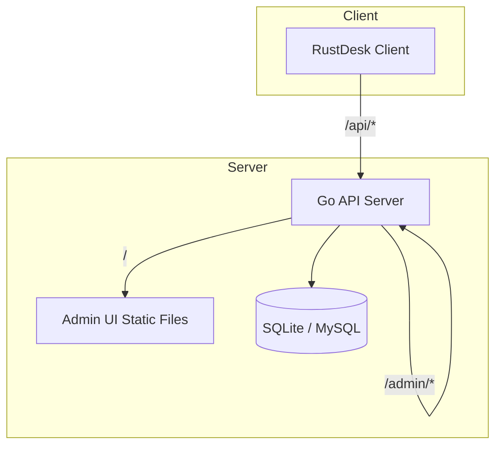

# RustDesk API Server Pro（兼容增强版）

[English](./README_EN.md)

RustDesk API Server Pro 是一个面向 RustDesk 客户端的第三方 API 服务端实现，包含管理后台前端（`soybean-admin`）。当前版本以“兼容增强”为目标，优先覆盖最新客户端主流程所需的 API，并尽量保持部署轻量与可维护。

🚨 <span style="color:red;">本项目部分内容由 ChatGPT 生成，仅供参考；请在生产环境前务必自行验证、严格测试，并依据业务需求谨慎调整。</span>

本文档为中文详细版，包含功能清单、架构图、部署步骤、配置说明、截图、FAQ 与 License。更细的专项文档请见文末文档索引。

## 最近更新

- 优化管理后台多语言词条，补齐“服务器配置”相关界面的翻译缺口
- 将“服务器获取的配置”从首页调整到左侧菜单：`系统管理 -> 服务器配置`
- 统一服务器配置页面中的缓存提示、时间文案等文本走 i18n，减少切换语言后的残留英文
- 修复英文语言包中的部分乱码与回退异常，提升多语言兜底显示质量

## 目录

- 项目概述
- 功能清单
- 架构图
- 目录结构
- 快速开始
- 配置说明（server.yaml）
- 端口与访问路径
- 管理后台与账号
- 第三方登录
- 数据与持久化
- 部署建议（生产）
- 升级与迁移
- 常见问题与排查
- 截图
- 文档索引
- License

## 项目概述

本项目由 Go 后端与 Vue 管理后台组成，采用单 HTTP 端口对外提供服务：

- RustDesk 客户端调用的 API（`/api/*`）
- 管理后台接口（`/admin/*`）
- 管理后台前端静态页面（`/`）

默认使用 SQLite，也支持 MySQL。配置文件统一为 `backend/server.yaml`（容器内为 `/app/data/server.yaml`）。

## 功能清单

- RustDesk 客户端主流程 API 兼容增强
- 地址簿读写与备注字段 `note` 兼容
- 设备列表、用户列表、审计日志基础能力
- 心跳、sysinfo、devices/cli 的最小兼容实现
- 录屏上传 `record` 的最小落盘流程（`new/part/tail/remove`）
- 管理后台前端（`soybean-admin`）静态页面
- OIDC 与 plugin-sign 兼容占位接口（用于避免 404）
- SMTP 配置预留（用于后台通知/模板邮件场景）

说明：部分高级能力仍为兼容占位实现，详见“常见问题与排查”。

## 架构图



## 目录结构

- `backend/` Go 后端 API 服务
- `soybean-admin/` 管理后台前端（构建后由后端同端口提供）
- `docker/` 容器启动脚本与辅助文件
- `docs/` 使用、端口、Docker、排障文档
- `docker-compose.yaml` Docker Compose 示例
- `Dockerfile` 容器镜像构建文件

## 快速开始

以下步骤会在首次启动时执行数据库同步（`sync`）。

### 方式一：二进制部署

1. 构建后端

```powershell
go build -o rustdesk-api-server-pro.exe .
```

2. 准备配置 `backend/server.yaml`

3. 同步数据库结构

```powershell
./rustdesk-api-server-pro.exe sync
```

4. 启动服务

```powershell
./rustdesk-api-server-pro.exe start
```

访问管理后台：`http://<服务器IP>:<端口>/`

### 方式二：Docker Compose（推荐）

```bash
mkdir -p /opt/rustdesk-api-server-pro/data
cd /opt/rustdesk-api-server-pro

# 准备 server.yaml（可从仓库示例复制并修改）
# backend/server.yaml

cat > docker-compose.yaml <<'YAML'
services:
  rustdesk-api-server-pro:
    container_name: rustdesk-api-server-pro
    image: ghcr.io/liyan-lucky/rustdesk-api-server-pro:latest
    environment:
      - "ADMIN_USER=admin"
      - "ADMIN_PASS=ChangeMe123!"
    volumes:
      - ./server.yaml:/app/server.yaml
      - ./data:/app/data
    network_mode: host
    restart: unless-stopped
YAML

docker compose up -d
```

说明：`ADMIN_USER` 与 `ADMIN_PASS` 仅首次启动有效，用于自动创建管理员账号。

## 配置说明（server.yaml）

关键配置位于 `backend/server.yaml`，容器内生效文件为 `/app/data/server.yaml`。

最小参考配置：

```yaml
signKey: "please-change-this-sign-key"
debugMode: false

db:
  driver: "sqlite"
  dsn: "./server.db"
  timeZone: "Asia/Shanghai"
  showSql: false

httpConfig:
  printRequestLog: false
  staticdir: "/app/dist"
  port: ":12345"

smtpConfig:
  host: "127.0.0.1"
  port: 1025
  username: ""
  password: ""
  encryption: "none"
  from: "noreply@example.com"
```

重点说明：

- `signKey` 必须修改
- `httpConfig.port` 为对外 HTTP 监听端口
- `httpConfig.staticdir` 为管理后台静态文件目录
- SQLite 默认数据库位于运行目录下的 `server.db`
- MySQL 可通过切换 `db.driver` 与 `db.dsn` 使用

## 端口与访问路径

默认是单端口架构（示例 `:12345`）：

- 管理后台页面：`/`
- RustDesk 客户端 API：`/api/*`
- 管理后台接口：`/admin/*`
- plugin-sign 兼容接口：`/lic/web/api/plugin-sign`

当 `/api` 可用但首页 404 时，请优先检查 `httpConfig.staticdir` 是否正确。

## 管理后台与账号

- 管理后台入口：`http://<host>:<port>/`
- Docker 首次启动时若设置 `ADMIN_USER` 与 `ADMIN_PASS` 会自动创建管理员
- 若需手动调整账号，请在容器内使用管理命令或修改数据库

## 第三方登录

当前后台已支持第三方管理员登录骨架，前端登录页会自动展示已启用的 provider。支持方式包括：

- 传统单 provider：`oidc`
- 多 provider：`oauth.providers`
- 内置 provider 类型：`oidc`、`google`、`github`

说明：

- 旧版 `oidc` 配置仍然保留兼容
- 新版推荐使用 `oauth.providers`
- 登录成功后仍走后台原有 token 体系，不会额外引入前端独立会话机制
- 若开启 `bindByEmail: true`，会优先按管理员邮箱绑定已有账号
- 若开启 `autoCreateAdmin: true`，在未绑定时可自动创建后台管理员账号

`backend/server.yaml` 示例：

```yaml
oauth:
  providers:
    - type: "google"
      name: "google"
      displayName: "Google"
      enabled: true
      clientId: "YOUR_GOOGLE_CLIENT_ID"
      clientSecret: "YOUR_GOOGLE_CLIENT_SECRET"
      bindByEmail: true
      autoCreateAdmin: false

    - type: "github"
      name: "github"
      displayName: "GitHub"
      enabled: true
      clientId: "YOUR_GITHUB_CLIENT_ID"
      clientSecret: "YOUR_GITHUB_CLIENT_SECRET"
      bindByEmail: true
      autoCreateAdmin: false

    - type: "oidc"
      name: "company-sso"
      displayName: "Company SSO"
      enabled: true
      issuer: "https://sso.example.com"
      clientId: "YOUR_OIDC_CLIENT_ID"
      clientSecret: "YOUR_OIDC_CLIENT_SECRET"
      scopes: ["openid", "profile", "email"]
      bindByEmail: true
      autoCreateAdmin: false
```

默认回调地址规则：

- 新版多 provider：`/admin/auth/oauth/<provider>/callback`
- 旧版兼容 OIDC：`/admin/auth/oidc/callback`

如果你使用反向代理，请确保外部访问域名与回调地址保持一致。

## 数据与持久化

建议持久化目录 `/app/data`，包含：

- `server.db`（SQLite）
- `server.yaml`（实际生效配置）
- `.init.lock`（首次初始化标记）
- `record_uploads/`（录屏文件）

未持久化将导致升级或重启后数据丢失。

## 部署建议（生产）

- 修改 `signKey`
- 明确 `httpConfig.port`
- 使用反向代理（Nginx/Caddy）统一 80/443
- 开启必要日志后排查完及时关闭 `printRequestLog`
- 使用最新 RustDesk 客户端完成冒烟验证

## 升级与迁移

每次升级建议执行：

```bash
rustdesk-api-server-pro sync
```

并重启服务。若数据库结构未同步，可能出现登录后部分页面报错、字段不存在等问题。

## 常见问题与排查

问题：管理后台首页打不开，但 `/api/*` 正常

原因：`httpConfig.staticdir` 指向错误或静态文件未构建

处理：确认 `staticdir` 指向 `soybean-admin/dist` 目录

问题：升级后列表/审计页面报 SQL 字段不存在

原因：数据库未执行 `sync`

处理：执行 `sync` 并重启服务

问题：RustDesk 客户端提示 404

原因：调用了尚未补齐的接口或使用旧二进制

处理：开启 `printRequestLog` 观察路径，升级服务到最新版本

问题：录屏上传失败

原因：`record_uploads/` 不可写或磁盘不足

处理：检查权限与磁盘空间

问题：OIDC / plugin-sign 无法使用

原因：当前为兼容占位实现

处理：如需完整功能需自行补齐逻辑

## 截图


## 文档索引

- 使用说明：`docs/USAGE.md`
- Docker 说明：`docs/DOCKER.md`
- 端口说明：`docs/PORTS.md`
- 排障手册：`docs/TROUBLESHOOTING.md`

## License

本项目使用 AGPL-3.0 许可证，详见 `LICENSE`。
