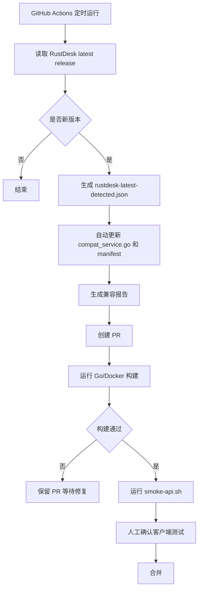

# RustDesk 官方版本自动跟踪与 API 匹配设想

本文档描述一个逐步演进的自动化方案：当 RustDesk 官方发布新版客户端后，本项目自动发现新版本、生成兼容目标、运行接口验证，并尽可能自动生成适配 PR。

## 1. 背景

RustDesk 客户端版本更新后，可能出现：

- 新增 API 探测路径。
- 旧 API 请求方法变化，例如 GET/POST 差异。
- 请求字段新增或改名。
- 响应字段新增或默认值变化。
- OIDC、地址簿、设备部署、审计、录屏等兼容接口行为变化。

如果完全靠人工发现，通常是在用户升级客户端后才发现某个接口 404 或响应不匹配。因此建议建立自动跟踪机制。

## 2. 自动化目标

分四层实现。

### 2.1 第一层：自动发现新版

通过 GitHub Actions 定时请求：

```text
https://api.github.com/repos/rustdesk/rustdesk/releases/latest
```

读取最新 release 的：

- `tag_name`
- `name`
- `published_at`
- `body`
- assets 文件名

与本仓库的 `docs/compat/rustdesk-current.json` 对比。如果发现版本不同，自动生成：

- `docs/compat/rustdesk-latest-detected.json`
- 一个 Pull Request 或 Issue
- 兼容检查清单

### 2.2 第二层：自动更新匹配对象

本仓库已提供：

```text
scripts/compat/check-rustdesk-release.sh
scripts/compat/update-compat-target.sh
scripts/compat/smoke-api.sh
.github/workflows/rustdesk-compat-watch.yml
```

自动流程：

1. `check-rustdesk-release.sh` 读取官方最新 release。
2. 发现新版本后生成 `docs/compat/rustdesk-latest-detected.json`。
3. `update-compat-target.sh` 自动修改：
   - `backend/internal/service/compat_service.go`
   - `docs/compat/rustdesk-current.json`
4. workflow 自动生成兼容报告。
5. workflow 自动创建适配 PR。
6. 维护者运行构建和 smoke test 后确认合并。

### 2.3 第三层：自动生成接口差异报告

后续可以继续增强脚本：

```text
scripts/compat/diff-rustdesk-release.sh
scripts/compat/extract-api-hints.sh
scripts/compat/run-compat-smoke.sh
```

输入：

- 官方 release changelog。
- 官方 tag 源码。
- 本项目 API 矩阵。
- 已保存的客户端请求样本。

输出：

- 新增疑似接口。
- 可能受影响模块。
- 需要人工验证的接口。
- 自动 curl smoke test 结果。

### 2.4 第四层：半自动生成行为适配 PR

对于只涉及版本目标的更新，脚本可以自动完成。

对于真正的 API 行为变化，建议由 Codex/AI 或人工基于差异报告继续修改控制器和服务层。

不建议在没有测试的情况下完全无人值守合并代码，因为官方客户端 API 不是稳定公开协议，自动推断可能会误判。

## 3. 本次 1.4.8 对齐范围

官方 1.4.8 重点变更被归纳为：

- Windows ARM64 支持。
- 远程工具栏显示器切换按钮。
- 隐私模式多显示器重构。
- 远程重启和自动连接调整。
- OIDC 图标从 Azure 调整为 Microsoft。

对本项目 API 的直接影响判断：

| 官方变化 | API 影响 | 本项目处理 |
| --- | --- | --- |
| Windows ARM64 | sysinfo 可能出现新的 OS/arch/platform 字段 | 保留 Raw，兼容 platform/os 字段 |
| 多显示器工具栏 | 可能触发连接/设备状态探测 | 保留 status/features/config/capabilities 探测接口 |
| 隐私模式多显示器 | 可能影响审计字段和策略字段 | 审计 Raw 已落库，策略接口保留兼容 |
| 远程重启自动连接 | 可能触发 devices/deploy、heartbeat、conn 审计 | devices/deploy GET/POST 返回稳定 NOT_ENABLED |
| OIDC 图标调整 | 后台 OAuth 名称显示变化 | 保留 google/github/oidc，多 provider 架构继续可用 |

## 4. 推荐自动更新流程



## 5. Smoke 测试

公开接口测试：

```bash
bash scripts/compat/smoke-api.sh http://127.0.0.1:12345
```

带 token 测试认证接口：

```bash
TOKEN="你的 RustDesk API token" bash scripts/compat/smoke-api.sh http://127.0.0.1:12345
```

## 6. 目录建议

```text
.github/workflows/rustdesk-compat-watch.yml
scripts/compat/check-rustdesk-release.sh
scripts/compat/update-compat-target.sh
scripts/compat/smoke-api.sh
docs/compat/rustdesk-current.json
docs/compat/rustdesk-latest-detected.json
docs/compat/reports/
```

## 7. 安全边界

自动化可以做：

- 发现新版。
- 更新版本目标文件。
- 生成报告。
- 创建 PR。
- 跑构建和 smoke test。

自动化不应该直接做：

- 未经测试自动合并。
- 根据 release 文本猜测复杂业务逻辑并直接上线。
- 修改登录、鉴权、授权逻辑后跳过人工审查。
- 修改 license/plugin-sign 相关行为后直接发布。

## 8. 后续增强方向

1. 保存真实 RustDesk 客户端请求样本，建立 `fixtures/compat/`。
2. 增加 Go 集成测试，覆盖登录、currentUser、ab、devices、audit、record。
3. 增加兼容占位命中统计，根据真实请求决定优先级。
4. 增加 Docker 自动构建验证。
5. 结合 GitHub Issues 自动生成“新版兼容任务”。
