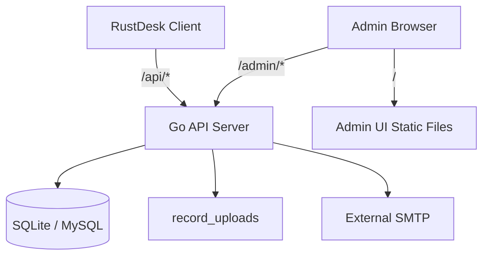

# RustDesk API Server Pro 项目详细描述

本文档根据仓库现有 README、`docs/` 文档、后端源码、前端源码、Docker 配置和构建脚本整理，用于快速理解项目定位、系统组成、核心流程、接口边界、数据模型和后续维护重点。

## 1. 项目定位

`RustDesk API Server Pro` 是一个面向 RustDesk 客户端的第三方 API 服务端实现，目标是提供一套轻量、可自托管、便于二次开发的 RustDesk API 与管理后台。

项目重点不是完整复刻官方 RustDesk Pro 的全部商业能力，而是优先保证新版客户端的常用主流程可用，包括：

- 客户端账号登录、退出和 token 管理。
- 客户端心跳、设备信息上报、设备在线状态维护。
- 地址簿读取、全量写入、增量维护、标签和备注字段兼容。
- 设备列表、用户列表、审计日志、文件传输日志。
- 管理后台登录、用户管理、会话管理、设备管理、仪表盘和邮件模板管理。
- 新版客户端常见兼容路径，避免 404 或响应结构不匹配。
- 后台第三方登录骨架，支持 OIDC、Google、GitHub 等 OAuth Provider。

当前版本适合的目标是“主流程可用、部署轻量、代码可维护、可按需继续补齐企业功能”。如果目标是完整替代官方 Pro，还需要继续实现更完整的权限模型、真实插件签名服务、完整客户端 OIDC 工作流等能力。

## 2. 总体架构

项目由三个主要部分组成：

- `backend/`：Go 后端服务，负责客户端 API、管理后台 API、静态资源托管、数据库访问和后台任务。
- `soybean-admin/`：Vue 3 管理后台，基于 Soybean Admin 模板改造，构建产物由后端同端口提供。
- `docker/`、`Dockerfile`、`docker-compose.yaml`：容器构建与运行入口。

运行时采用单 HTTP 端口架构：



默认情况下：

- 管理后台页面入口是 `/`。
- RustDesk 客户端接口前缀是 `/api`。
- 管理后台接口前缀是 `/admin`。
- 插件签名兼容接口前缀是 `/lic/web/api`。
- 数据库默认是 SQLite，配置也支持 MySQL。

## 3. 关键技术栈

后端：

- Go 1.21.4。
- Cobra：命令行入口，包含 `start`、`sync`、`user add`、`rustdesk` 等命令。
- Iris v12：HTTP 服务和 MVC 控制器。
- Xorm：数据库 ORM。
- modernc.org/sqlite：SQLite 驱动。
- go-sql-driver/mysql：MySQL 驱动。
- gocron v2：后台定时任务。
- go-simple-mail：SMTP 邮件发送。
- base64Captcha：管理后台验证码。
- pquerna/otp：TOTP 二次验证。

前端：

- Vue 3。
- Vite 5。
- TypeScript。
- Naive UI。
- Pinia。
- Vue Router。
- Vue I18n。
- UnoCSS。
- Elegant Router。
- Soybean Admin 工程结构。

## 4. 目录结构说明

主要目录和文件职责如下：

```text
.
├─ backend/                  Go 后端服务
│  ├─ app/
│  │  ├─ controller/          Iris MVC 控制器
│  │  │  ├─ api/              RustDesk 客户端 API
│  │  │  └─ admin/            管理后台 API
│  │  ├─ form/                请求表单结构
│  │  ├─ middleware/          客户端和后台鉴权中间件
│  │  ├─ model/               Xorm 数据模型
│  │  ├─ service/             旧版业务服务
│  │  ├─ jobs.go              定时任务
│  │  ├─ main.go              Iris 应用创建和启动
│  │  └─ route.go             路由注册
│  ├─ cmd/                    Cobra 命令
│  ├─ config/                 server.yaml 配置结构和读写
│  ├─ db/                     Xorm Engine 初始化
│  ├─ helper/                 Captcha、GitHub、RustDesk Server 辅助
│  ├─ internal/
│  │  ├─ core/                新版业务用例的命令、查询、结果模型
│  │  ├─ repository/          仓储接口和 Xorm 实现
│  │  ├─ service/             新版业务服务层
│  │  └─ transport/httpdto/   HTTP 响应 DTO
│  ├─ util/                   文件、HTTP、加密、进程等工具
│  ├─ main.go                 程序入口
│  └─ server.yaml             示例配置
├─ soybean-admin/             管理后台前端
│  ├─ src/service/api/        后台 API 调用封装
│  ├─ src/views/              页面
│  ├─ src/router/             路由和路由守卫
│  ├─ src/store/              Pinia Store
│  ├─ src/locales/            多语言词条
│  └─ package.json            前端脚本和依赖
├─ docs/                      项目文档
├─ docker/start.sh            容器启动脚本
├─ Dockerfile                 多阶段镜像构建
├─ docker-compose.yaml        Compose 示例
└─ Makefile                   本地构建辅助
```

## 5. 后端启动与运行链路

程序入口是 `backend/main.go`：

1. 调用 `cmd.RootCmd.Execute()`。
2. 根据命令执行对应子命令。
3. `start` 命令调用 `app.StartServer()`。
4. `StartServer()` 读取 `server.yaml`，启动定时任务，创建 Iris 应用。
5. Iris 应用初始化数据库、注册依赖、注册路由、挂载静态目录。
6. 监听 `httpConfig.port`。

`app.newApp()` 的主要工作：

- 创建 Iris 默认应用。
- 通过 `db.NewEngine(cfg.Db)` 建立 Xorm Engine。
- 将数据库 Engine 和配置对象注册为 Iris 依赖。
- 注册 404 日志输出。
- 启用压缩中间件。
- 按配置决定是否启用请求日志。
- 调用 `SetRoute(app)` 注册 API 路由。
- 通过 `app.HandleDir("/", iris.Dir(cfg.HttpConfig.StaticDir))` 托管前端静态文件。

## 6. 命令行能力

后端二进制提供以下主要命令：

```text
rustdesk-api-server-pro start
rustdesk-api-server-pro sync
rustdesk-api-server-pro user add <username> <password> --admin
rustdesk-api-server-pro rustdesk install
rustdesk-api-server-pro rustdesk start
rustdesk-api-server-pro rustdesk stop
rustdesk-api-server-pro rustdesk restart
rustdesk-api-server-pro rustdesk status
rustdesk-api-server-pro rustdesk keys
rustdesk-api-server-pro rustdesk list
```

重点说明：

- `start`：启动 API 服务和静态资源服务。
- `sync`：同步数据库结构，新增或升级字段后必须执行。
- `user add`：手动创建用户，可通过 `--admin` 创建后台管理员。
- `rustdesk install/start/stop/...`：下载和管理 RustDesk Server 的 `hbbs`、`hbbr` 辅助能力。

容器模式下 `docker/start.sh` 会自动执行：

1. 创建 `/usr/local/bin/rustdesk-api-server-pro` 软链接。
2. 创建 `/app/data`。
3. 将 `/app/server.yaml` 复制到 `/app/data/server.yaml`。
4. 切换工作目录到 `/app/data`。
5. 执行 `rustdesk-api-server-pro sync`。
6. 如果首次启动且设置了 `ADMIN_USER`、`ADMIN_PASS`，自动创建管理员。
7. 执行 `rustdesk-api-server-pro start`。

## 7. 配置文件

配置文件由 `backend/config/config.go` 管理。程序读取当前工作目录下的 `server.yaml`。如果文件不存在或解析失败，会写入默认配置。

常用配置项：

```yaml
signKey: "please-change-this-sign-key"
debugMode: false

db:
  driver: "sqlite"
  dsn: "./server.db"
  timeZone: "Asia/Shanghai"
  showSql: false

httpConfig:
  printRequestLog: false
  staticdir: "/app/dist"
  port: ":12345"

smtpConfig:
  host: "127.0.0.1"
  port: 1025
  username: ""
  password: ""
  encryption: "none"
  from: "noreply@example.com"

jobsConfig:
  deviceCheckJob:
    duration: 30
```

配置重点：

- `signKey` 用于生成客户端 token、后台 token 和 OAuth signed state，生产环境必须修改。
- `db.driver` 支持 `sqlite` 和 `mysql`。
- `db.dsn` 是数据库连接字符串。SQLite 相对路径基于进程工作目录。
- `httpConfig.staticdir` 是前端构建产物目录。
- `httpConfig.port` 是唯一 HTTP 监听端口。
- `smtpConfig` 用于邮箱验证码和邮件模板发送。
- `jobsConfig.deviceCheckJob.duration` 控制设备在线状态检查周期。

容器环境的实际工作目录是 `/app/data`，所以推荐持久化 `/app/data`，并确保最终生效配置为 `/app/data/server.yaml`。

## 8. 数据库与持久化

数据库通过 Xorm 自动同步模型。`sync` 命令会同步以下主要表：

| 表 | 模型 | 用途 |
| --- | --- | --- |
| `user` | `User` | 客户端用户和后台管理员 |
| `auth_token` | `AuthToken` | 客户端 token、后台 token 和会话 |
| `device` | `Device` | RustDesk 设备、在线状态、系统信息 |
| `peer` | `Peer` | 地址簿设备条目 |
| `tags` | `Tags` | 旧标签模型 |
| `address_book` | `AddressBook` | 地址簿主体 |
| `address_book_tag` | `AddressBookTag` | 地址簿标签和颜色 |
| `audit` | `Audit` | 连接审计日志 |
| `file_transfer` | `FileTransfer` | 文件传输日志 |
| `mail_template` | `MailTemplate` | 邮件模板 |
| `mail_logs` | `MailLogs` | 邮件发送日志 |
| `verify_code` | `VerifyCode` | 邮箱验证码和 TOTP 登录过程记录 |
| `system_settings` | `SystemSettings` | 系统设置预留 |
| `device_group` | `DeviceGroup` | 企业兼容设备分组 |
| `device_group_device` | `DeviceGroupDevice` | 设备分组关系 |
| `user_group` | `UserGroup` | 企业兼容用户分组 |
| `user_group_member` | `UserGroupMember` | 用户分组关系 |
| `strategy` | `Strategy` | 企业兼容策略 |
| `strategy_assignment` | `StrategyAssignment` | 策略分配关系 |
| `oauth_account` | `OAuthAccount` | 后台 OAuth 账号绑定 |

建议持久化内容：

- SQLite 数据库文件，例如 `server.db`。
- `server.yaml`。
- `.init.lock`。
- `record_uploads/`。

## 9. 鉴权模型

项目区分客户端鉴权和后台鉴权。

客户端 API：

- 中间件：`middleware.ApiAuth`。
- Token 来源：HTTP Header 中的 JWT/Header token，代码使用 Iris JWT helper 从 Header 读取。
- 查询条件：`auth_token.token` 匹配、未过期、`status = 1`、`is_admin = 0`。
- 用户条件：`user.status > 0`。

后台 API：

- 中间件：`middleware.AdminAuth`。
- Token 来源：`Authorization` Header。
- 查询条件：`auth_token.token` 匹配、未过期、`status = 1`、`is_admin = 1`。
- 用户条件：`user.status > 0` 且 `is_admin = 1`。
- 后台 token 默认 2 小时有效；距离过期 5 分钟以内访问接口会自动续期 2 小时。

客户端普通登录生成的 token：

- 存在 `auth_token` 表。
- `is_admin = false`。
- 默认有效期 90 天。
- 同一用户同一 RustDesk ID 的旧 token 会置为失效。

后台登录生成的 token：

- 存在 `auth_token` 表。
- `is_admin = true`。
- 默认有效期 2 小时。
- 同一管理员旧后台 token 会置为失效。

## 10. RustDesk 客户端 API

客户端 API 前缀是 `/api`。其中部分接口不需要客户端 token，部分接口需要 `ApiAuth`。

### 10.1 公共客户端接口

| 方法 | 路径 | 说明 |
| --- | --- | --- |
| `POST` | `/api/login` | 客户端账号登录，支持普通密码、邮箱验证码步骤、TOTP 步骤 |
| `GET` | `/api/login-options` | 返回已启用的第三方登录选项名称 |
| `POST` | `/api/heartbeat` | 设备心跳，上报 RustDesk ID、UUID、连接数，刷新在线状态 |
| `POST` | `/api/sysinfo` | 设备系统信息上报，更新 CPU、主机名、内存、系统、用户名、版本等 |
| `POST` | `/api/sysinfo_ver` | 返回兼容版本字符串 |
| `POST` | `/api/oidc/auth` | 客户端 OIDC 兼容响应 |
| `GET` | `/api/oidc/auth-query` | 客户端 OIDC 查询兼容响应 |
| `POST` | `/api/record` | 录屏上传最小兼容，支持 `new`、`part`、`tail`、`remove` |

`/api/record` 会将文件写入运行目录下的 `record_uploads/`。文件名经过 `filepath.Base` 和 `..` 清理，但仍应在生产环境中控制访问权限和磁盘容量。

### 10.2 需要客户端 token 的接口

| 方法 | 路径 | 说明 |
| --- | --- | --- |
| `POST` | `/api/currentUser` | 返回当前客户端用户信息 |
| `GET` | `/api/users` | 用户列表，带 `accessible` 时走兼容查询逻辑 |
| `POST` | `/api/logout` | 客户端退出，按 RustDesk ID 使 token 失效 |
| `GET` | `/api/peers` | 地址簿/设备条目列表 |
| `GET` | `/api/ab` | 旧版地址簿读取 |
| `POST` | `/api/ab` | 旧版地址簿全量替换 |
| `POST` | `/api/ab/personal` | 确保个人地址簿存在并返回 guid |
| `POST` | `/api/ab/settings` | 返回地址簿设置 |
| `POST` | `/api/ab/shared/profiles` | 返回共享地址簿 profile 列表 |
| `POST` | `/api/ab/peers` | 地址簿 peer 列表 |
| `POST` | `/api/ab/peer/add/{guid}` | 向地址簿添加 peer |
| `PUT` | `/api/ab/peer/update/{guid}` | 更新地址簿 peer |
| `DELETE` | `/api/ab/peer/{guid}` | 删除地址簿 peer |
| `POST` | `/api/ab/tags/{guid}` | 地址簿标签列表 |
| `POST` | `/api/ab/tag/add/{guid}` | 新增标签 |
| `PUT` | `/api/ab/tag/update/{guid}` | 更新标签颜色 |
| `PUT` | `/api/ab/tag/rename/{guid}` | 重命名标签 |
| `DELETE` | `/api/ab/tag/{guid}` | 删除标签 |
| `POST` | `/api/audit/conn` | 连接审计创建、关闭、会话更新、备注更新 |
| `POST` | `/api/audit/file` | 文件传输审计写入 |
| `POST` | `/api/audit/alarm` | 告警上报兼容接收 |
| `PUT` | `/api/audit` | 按 guid 更新审计备注 |
| `GET` | `/api/device-group/accessible` | 返回可访问设备分组 |
| `POST` | `/api/devices/cli` | 客户端 CLI 兼容更新，支持设备名、用户名、地址簿备注、别名、密码、标签等 |

### 10.3 企业兼容 API

以下接口挂在 `/api` 下，但内部要求当前用户是管理员，否则返回 `Admin required!`。

设备分组：

- `GET /api/device-groups`
- `POST /api/device-groups`
- `GET /api/device-groups/{guid}`
- `PUT /api/device-groups/{guid}`
- `DELETE /api/device-groups/{guid}`
- `GET /api/device-groups/{guid}/devices`
- `POST /api/device-groups/{guid}/devices`

用户分组：

- `GET /api/user-groups`
- `POST /api/user-groups`
- `GET /api/user-groups/{guid}`
- `PUT /api/user-groups/{guid}`
- `DELETE /api/user-groups/{guid}`

策略：

- `GET /api/strategies`
- `POST /api/strategies`
- `GET /api/strategies/{guid}`
- `PUT /api/strategies/{guid}`
- `DELETE /api/strategies/{guid}`
- `GET /api/strategies/{guid}/status`
- `POST /api/strategies/assign`

设备管理：

- `GET /api/devices`
- `GET /api/devices/{guid}`
- `POST /api/devices/{guid}/enable`
- `POST /api/devices/{guid}/disable`
- `POST /api/devices/{guid}/assign`

用户管理兼容：

- `GET /api/users/{guid}`
- `POST /api/users/{guid}/enable`
- `POST /api/users/{guid}/disable`
- `POST /api/users/disable_login_verification`
- `POST /api/users/force-logout`
- `POST /api/users/invite`
- `POST /api/users/tfa/totp/enforce`

这些接口提供最小持久化和兼容响应，但不是完整官方 Pro 权限模型。

## 11. License 兼容接口

插件签名兼容接口单独挂载在 `/lic/web/api`：

| 方法 | 路径 | 说明 |
| --- | --- | --- |
| `POST` | `/lic/web/api/plugin-sign` | 返回 `{ signed_msg: ... }` 结构，当前实现会把请求中的 `msg` 原样返回 |

该接口用于避免客户端或插件流程因为 404 或 JSON 解码失败而中断。它不是官方真实插件签名服务。

## 12. 管理后台 API

管理后台前端的生产 API Base URL 是 `/admin`，开发环境默认是 `http://localhost:12345/admin` 或 Vite 代理。

### 12.1 公共后台接口

| 方法 | 路径 | 说明 |
| --- | --- | --- |
| `POST` | `/admin/auth/login` | 管理员账号密码登录，要求验证码正确 |
| `GET` | `/admin/auth/captcha` | 获取验证码 |
| `GET` | `/admin/auth/oidc/url` | 旧版 OIDC 授权地址 |
| `GET` | `/admin/auth/oidc/token` | 旧版 OIDC ticket 换后台 token |
| `GET` | `/admin/auth/oidc/callback` | 旧版 OIDC 回调 |
| `GET` | `/admin/auth/oauth/providers` | 已启用 OAuth Provider 列表 |
| `GET` | `/admin/auth/oauth/url` | 指定 Provider 的授权地址 |
| `GET` | `/admin/auth/oauth/token` | OAuth ticket 换后台 token |
| `GET` | `/admin/auth/oauth/{provider}/callback` | 新版多 Provider OAuth 回调 |

后台普通登录要求：

- 用户存在。
- `is_admin = 1`。
- 密码校验通过。
- 验证码校验通过。

### 12.2 需要后台 token 的接口

| 方法 | 路径 | 说明 |
| --- | --- | --- |
| `GET` | `/admin/userinfo` | 当前管理员信息和角色 |
| `GET` | `/admin/dashboard/stat` | 仪表盘统计 |
| `GET` | `/admin/dashboard/line/charts` | 仪表盘折线图 |
| `GET` | `/admin/dashboard/pie/charts` | 仪表盘饼图 |
| `GET` | `/admin/dashboard/server/config` | 服务端连接配置摘要 |
| `GET` | `/admin/dashboard/server/connectivity` | 服务连通性检测 |
| `GET` | `/admin/users/list` | 用户列表 |
| `POST` | `/admin/users/add` | 新增用户 |
| `POST` | `/admin/users/edit` | 编辑用户 |
| `POST` | `/admin/users/delete` | 删除用户 |
| `POST` | `/admin/users/totp` | 更新用户 TOTP |
| `GET` | `/admin/sessions/list` | 会话列表 |
| `POST` | `/admin/sessions/kill` | 踢出会话 |
| `GET` | `/admin/devices/list` | 设备列表 |
| `GET` | `/admin/audit/list` | 连接审计日志 |
| `GET` | `/admin/audit/file-transfer-list` | 文件传输日志 |
| `GET` | `/admin/mail/templates/list` | 邮件模板列表 |
| `POST` | `/admin/mail/templates/add` | 新增邮件模板 |
| `POST` | `/admin/mail/templates/edit` | 编辑邮件模板 |
| `GET` | `/admin/mail/logs/list` | 邮件日志列表 |
| `GET` | `/admin/mail/logs/info` | 邮件日志详情 |

管理后台 API 统一返回形态是：

```json
{
  "code": 200,
  "data": {},
  "message": "ok"
}
```

前端请求层会判断 `code` 是否等于 `VITE_SERVICE_SUCCESS_CODE`，默认是 `200`。

## 13. 后台 OAuth / OIDC 登录

项目支持两类后台第三方登录配置：

- 旧版单 Provider：`oidc`。
- 新版多 Provider：`oauth.providers`。

内置 Provider 类型：

- `oidc`
- `google`
- `github`

新版流程：

1. 前端调用 `/admin/auth/oauth/providers` 获取启用的 Provider。
2. 用户点击 Provider 后调用 `/admin/auth/oauth/url?provider=<name>`。
3. 后端生成授权地址和 signed state。
4. Provider 回调 `/admin/auth/oauth/<provider>/callback`。
5. 后端通过 code 换 token，读取 userinfo 或 id token claims。
6. 根据 `provider + subject` 查找 `oauth_account`。
7. 找不到时按配置使用邮箱绑定已有管理员或自动创建管理员。
8. 后端签发后台 token，并生成短期 ticket。
9. 前端用 ticket 调用 `/admin/auth/oauth/token` 换 token。

关键配置：

- `enabled`：是否启用。
- `clientId`、`clientSecret`：Provider 凭据。
- `issuer` 或显式 `authorizationEndpoint`、`tokenEndpoint`、`userinfoEndpoint`。
- `redirectUrl`：显式回调地址；为空时根据当前请求 Host 生成。
- `bindByEmail`：是否按邮箱绑定已有管理员。
- `autoCreateAdmin`：找不到管理员时是否自动创建。
- `allowedEmailDomains`：可选邮箱域名白名单。
- `stateTtlSeconds`、`ticketTtlSeconds`：state 和 ticket 有效期，默认 180 秒。

安全注意：

- OAuth state 使用 `signKey` 做 HMAC 签名。
- 回调重定向目标会拒绝外部完整 URL，只允许站内路径。
- 自动创建管理员应谨慎开启。
- 生产环境必须使用固定、强随机 `signKey`。

## 14. 定时任务

`app.StartJobs()` 启动一个设备在线状态检查任务。

逻辑：

- 周期由 `jobsConfig.deviceCheckJob.duration` 控制，默认 30 秒。
- 每次检查 `device` 表。
- 如果 `is_online = 1` 且 `updated_at` 早于当前时间减 30 秒，则将 `is_online` 更新为 `false`。

影响：

- 客户端需要持续上报 `/api/heartbeat` 才会保持在线。
- 如果任务周期或心跳间隔配置不合理，设备可能频繁显示离线。

## 15. 管理后台前端

`soybean-admin/` 是管理后台前端工程。

主要页面：

- `/login`：管理员登录和第三方登录入口。
- `/home`：仪表盘。
- `/devices`：设备列表。
- `/user/list`：用户管理。
- `/user/sessions`：会话管理。
- `/audit/baselogs`：连接审计。
- `/audit/filetransferlogs`：文件传输日志。
- `/system/mail/template`：邮件模板。
- `/system/mail/logs`：邮件日志。
- `/system/server`：服务器配置和连通性页面。

请求配置：

- 生产环境 `.env.prod`：`VITE_SERVICE_BASE_URL=/admin`。
- 测试环境 `.env.test`：`VITE_SERVICE_BASE_URL=http://localhost:12345/admin`。
- 开发环境可通过 `VITE_HTTP_PROXY=Y` 使用 Vite 代理。
- 所有管理 API 请求会自动带上 `Authorization` Header。

构建命令：

```bash
cd soybean-admin
pnpm install
pnpm typecheck
pnpm build
```

构建产物在 `soybean-admin/dist`，部署时后端 `httpConfig.staticdir` 必须指向该目录或镜像内的 `/app/dist`。

## 16. Docker 与构建

`Dockerfile` 使用三阶段构建：

1. `golang:alpine` 构建 Go 后端。
2. `node:20-alpine` 构建前端。
3. `alpine:3.20.3` 复制后端二进制、默认 `server.yaml`、前端 `dist` 和启动脚本。

镜像默认：

- 工作目录：`/app`。
- 暴露端口：`8080`，但真实监听端口由 `server.yaml` 的 `httpConfig.port` 决定。
- 启动命令：`sh /app/start.sh`。

Compose 示例使用：

- `network_mode: host`。
- `./server.yaml:/app/server.yaml`。
- `./data:/app/data`。
- `ADMIN_USER`、`ADMIN_PASS` 用于首次自动创建管理员。

## 17. 本地开发建议

后端：

```bash
cd backend
go build
go test ./...
go vet ./...
./rustdesk-api-server-pro sync
./rustdesk-api-server-pro start
```

前端：

```bash
cd soybean-admin
pnpm install
pnpm dev
pnpm typecheck
pnpm build
```

完整镜像：

```bash
docker build -t rustdesk-api-server-pro:local .
```

本地联调建议：

- 后端监听 `:12345`。
- 前端 `pnpm dev` 使用 Vite 端口 `9527`。
- `.env.test` 指向 `http://localhost:12345/admin`。
- 客户端 API 直接访问 `http://localhost:12345/api/...`。

## 18. 当前能力边界

已经具备的能力：

- 客户端账号登录、邮箱验证码流程、TOTP 流程。
- 客户端 token 和后台 token 的独立管理。
- 地址簿旧接口和新版增量接口的主要字段兼容。
- 地址簿备注 `note` 读写。
- 设备心跳、设备信息更新、在线状态定时维护。
- 后台用户、会话、设备、审计、邮件模板和邮件日志管理。
- 后台 OAuth 多 Provider 登录骨架。
- 设备分组、用户分组、策略的最小持久化兼容接口。
- 录屏上传最小落盘。
- plugin-sign 响应结构兼容。

需要注意的限制：

- 客户端 OIDC 是兼容响应，不是完整客户端 OIDC 登录实现。
- plugin-sign 不是官方真实签名服务。
- 企业分组、策略、accessible 权限是最小兼容模型，不是完整官方权限模型。
- 录屏上传只负责文件落盘，没有完整索引、归档、清理和权限控制。
- 邮件能力依赖模板和 SMTP 配置，未配置时邮箱验证会失败。
- 默认配置中的 `signKey` 只是示例，生产环境必须替换。

## 19. 运维与排查重点

上线前建议检查：

1. 修改 `signKey`。
2. 确认 `server.yaml` 放在程序工作目录下。
3. 执行 `sync`。
4. 确认 `httpConfig.port` 和反向代理配置一致。
5. 确认 `httpConfig.staticdir` 指向真实前端构建产物。
6. 持久化数据库和 `/app/data`。
7. 创建管理员账号。
8. 用 RustDesk 客户端验证登录、地址簿、设备列表、审计写入。
9. 如使用第三方登录，检查回调地址和 Provider 配置完全一致。

常见问题入口：

- `/api/*` 正常但首页打不开：检查 `httpConfig.staticdir`。
- 登录后页面报 SQL 字段不存在：执行 `sync` 后重启。
- 设备在线状态不准：检查客户端心跳和 `deviceCheckJob.duration`。
- OAuth 回调失败：检查 `redirectUrl`、反代 Host、`X-Forwarded-Proto`、`X-Forwarded-Host`。
- 录屏文件没有生成：检查运行目录、`record_uploads/` 权限和磁盘空间。
- 客户端新功能 404：开启 `printRequestLog` 看实际路径，再补路由或确认是否启动旧二进制。

## 20. 后续开发优先级建议

如果继续增强项目，建议按风险和收益排序：

1. 补齐接口自动化测试，优先覆盖登录、地址簿、心跳、审计、OAuth。
2. 为客户端 API 和后台 API 补充 OpenAPI 或接口清单。
3. 实现完整客户端 OIDC 登录，而不是仅返回兼容响应。
4. 实现真实 plugin-sign 签名服务，包括密钥管理和验签链路。
5. 完善企业权限模型，包括用户组、设备组、策略、accessible 查询的一致性。
6. 为录屏上传增加索引、清理策略、访问控制和容量限制。
7. 增加数据库迁移版本管理，降低仅依赖 Xorm Sync 的升级风险。
8. 明确生产日志、审计保留周期、备份恢复流程。

## 21. 快速结论

这个项目可以理解为：

> 一个 Go + Vue 的 RustDesk API 兼容服务端，使用单端口同时提供客户端 API、管理员 API 和后台页面。它已经覆盖自托管使用中的主要流程，并为新版客户端补了若干兼容端点；但企业级权限、插件签名和完整 OIDC 等高级能力仍需要按实际需求继续开发。

